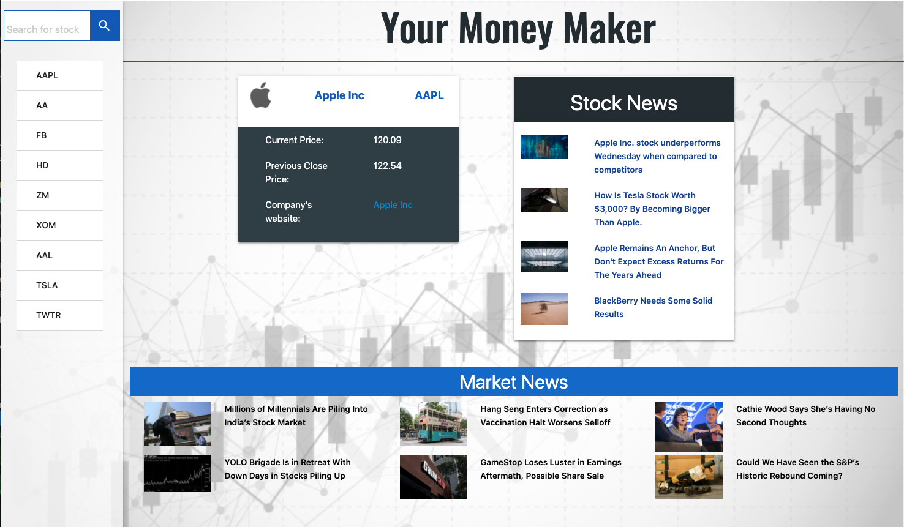

# Money Maker

Our goal is to simplify investing news in order to get more people to start investing. The current landscape gives us complex information in an even more complex way, which can be intimidating for new investors. With Money Maker, when an user searches for a stock ticker, user gets back:
* current stock price
* previous closing price
* Company Website
* stock news
* User will also always be able to see the latest Market News

## Project Contributers
* Hila Caspi
* Arun Chowdhury
* Anuj Chatterjee

## Technologies used:
* HTML/CSS
* Materialize CSS Framework
* JavaScript
* JQuery
* Moment.js

## Apis used:
* Finnhub (https://finnhub.io/api/v1)
* Bloomberg (https://bloomberg-market-and-financial-news.p.rapidapi.com/)

## Demo

## ScreenShot
